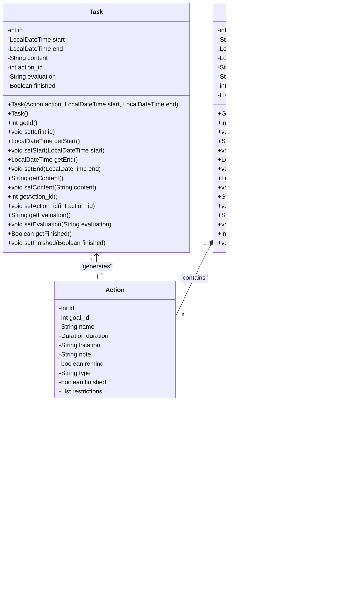

# “时间流（Time Flow）”项目报告

---

**目录**

1. [项目简介](#1-项目简介)
2. [需求分析](#2-需求分析)
3. [项目架构](#3-项目架构)
4. [特色功能](#4-特色功能)
5. [用户界面设计](#5-用户界面设计)
6. [技术实现](#6-技术实现)
7. [项目进展](#7-项目进展)
8. [测试与质量保证](#8-测试与质量保证)
9. [用户反馈和市场推广](#9-用户反馈和市场推广)
10. [风险评估与应对策略](#10-风险评估与应对策略)
11. [项目成果和未来展望](#11-项目成果和未来展望)

[附录](#附录)

---

# 1. 项目简介

## 1.1 项目名称

[时间流（Time Flow）](https://luohaomin.github.io/timeflow)

## 1.2 项目概述

时间流是一款主要为中国科学技术大学（USTC）学生和教师设计的时间管理工具，旨在通过智能化的日程规划和提醒功能，帮助用户更高效地安排学习、工作和休闲时间。本软件通过分析用户的历史数据和行为模式，提供个性化的日程安排建议，确保用户能够在忙碌的学习和工作中保持平衡，充分利用每一分每一秒。

## 1.3 项目目标

1. 提供一个用户友好的界面，使日程管理变得直观和简单。
2. 通过智能算法优化日程安排，减少时间浪费，提高效率。
3. 通过数据分析，为用户提供个性化的时间管理建议。
4. 增加用户对时间价值的认识，培养良好的时间管理习惯。

## 1.4 项目重要性

在快节奏的学习和工作环境中，有效的时间管理对于提高生产力和生活质量至关重要。时间流通过智能化的工具和功能，帮助用户克服拖延，优先处理重要任务，并在紧张的日程中找到休息和放松的时间，从而实现工作与生活的平衡。

## 1.5 特色功能

时间流项目通过以下特色功能提供全面、个性化且高效的时间管理体验：

### 1. 目标与任务管理

- **目标设定**：用户能够设定并分解短期和长期目标为具体任务。
- **任务排布**：智能算法根据用户的工作模式和优先级优化任务安排。

### 2. 进度跟踪与反馈

- **进度跟踪**：实时反馈机制让用户能够跟踪目标和任务的完成进度。
- **自我反思**：定期评估促进用户自我反思，以持续改进时间管理。

### 3. 用户体验优化

- **自动任务列表**：软件自动生成每日任务列表，减少规划时间。
- **极简设计**：简洁直观的用户界面，提升用户完成任务的动力。

### 4. 集成与辅助功能

- **第三方服务集成**：采集校园班车信息与该用户在教务系统、青春科大平台、预约系统上的信息，提供一站式体验。
- **习惯养成**：habit-tracking功能帮助用户建立和维持良好习惯。

### 5. 数据分析与支持

- **决策支持**：提供数据分析工具，帮助用户基于数据做出决策。

## 1.6 开发团队

时间流项目由罗浩民、王子宁采用敏捷开发方法进行开发，确保项目的灵活性和适应性，以及快速响应用户需求和市场变化。

时间流项目团队致力于将这款软件打造成为科大师生的时间管理助手，让科大人的生活更加充实而多彩。通过时间流，我们希望能够激发用户对时间的重视，培养良好的时间管理习惯，最终实现个人目标和梦想。

# 2. 需求分析

## 2.1 用户需求调研结果

通过用户调研，我们发现时间流（Time Flow）的目标用户群体——科大学生和教师，面临着日程管理、任务优先级排序、提醒服务、学年计划细分、工作报告生成以及附加功能（如二课报名提醒、运动监测等）的核心需求。用户需要一个直观、易用且美观的界面来管理他们的日程，同时也期望软件能够提供个性化的日程安排建议和实时反馈。

## 2.2 市场分析和竞品分析

市场分析显示，时间管理软件市场正在快速增长，这一趋势得益于社会节奏的加快和手机、互联网在生活中的渗透，导致越来越多的人需要提高时间利用效率。用户群体主要是24岁以下的学生和职场新人，他们对办公效率软件有着更大的需求。女性用户和一线城市用户对此类软件的需求更为明显。

在竞品分析方面，市场上存在几款较为常见的时间管理软件，如番茄ToDo和Forest。这些软件各有特点，例如番茄ToDo以番茄工作法为基础，提供待办、锁机、自习室等功能，而Forest则通过种植虚拟树木的方式鼓励用户专注。尽管这些软件已经占据了一定的市场份额，但仍有不足之处，特别是在目标导向和个性化功能上。

时间流项目通过其目标导向的设计和智能化功能，旨在填补市场空白，吸引追求高生产力和明确生活目标的用户群体。与竞品相比，时间流的特色功能如目标导向的时间管理、智能任务排布、实时反馈与调整、用户任务列表自动生成、极简化任务、集成第三方服务、习惯养成辅助、数据驱动的决策支持以及促进自我反思等，使其在市场中具有明显的竞争优势。这些特色功能不仅满足了用户对时间管理的基本需求，还提供了更深层次的个性化服务和自我提升的机会。

## 2.3 需求概述

基于用户调研和市场分析，时间流项目的主要需求可以概述如下：

- **目标设定与管理**：用户可以创建和管理个人目标，包括短期项目管理和长期生活规划。
- **任务管理**：用户可以添加、编辑、删除任务，并为任务设置地点、备注、提醒和优先级。
- **智能日程安排**：软件需要能够根据用户的输入和历史数据自动生成合理的日程安排。
- **习惯养成**：用户可以通过每日打卡来养成良好习惯，并接收进度反馈。
- **通知和提醒**：软件需要提供定时提醒功能，帮助用户避免遗漏重要任务。
- **反馈机制**：软件需要提供任务、习惯和目标的进度反馈，以及周期性总结。
- **附加功能**：包括番茄钟、信息筛选器、课程表与校车信息等，以提升用户体验。
- **扩展性与集成**：软件设计需要考虑未来的功能扩展和与其他工具的集成。

## 2.5 非功能需求概述

除了功能需求外，我们还识别了以下非功能需求：

- **性能要求**：软件应保证快速响应和数据同步。
- **安全性要求**：用户数据必须加密，且软件需提供用户认证机制。
- **可用性要求**：软件应提供直观的用户界面和良好的可访问性。
- **扩展性要求**：软件应采用模块化设计，以便于未来功能的扩展。

# 3. 项目架构

## 3.1 技术架构概述

时间流（Time Flow）项目的技术架构分为三个主要层次：表示层、数据层和模型层。每一层都有其特定的职责和组件，以确保系统的高内聚低耦合。该项目专为移动端（Android）设计，采用Room框架作为数据库解决方案，基于SQLite实现数据的持久化存储。

### 3.1.1 表示层

表示层负责向用户提供接口和视图，是用户与系统交互的前端部分。它包括：

- **用户界面（UI）：** 设计直观、响应式的用户界面，支持不同设备和屏幕尺寸。
- **用户界面设计（UID）：** 包括主页面、计划总览页面以及其他界面的设计方案。
- **前端框架：** 使用Android原生组件构建用户界面，确保与Android系统的兼容性。

### 3.1.2 数据层

数据层负责存储和检索项目的所有数据，包括实体类和数据库设计。

- **实体类：** 定义了Action、Goal、Task和Milestone等实体类，这些类将被映射到数据库表中，如下图。
- **数据库设计：** 使用Room框架（基于SQLite）来存储和管理数据。Room提供了一个抽象层，使得使用SQLite数据库变得更加简单和方便，支持对象关系映射（ORM），并提供编译时验证和简化的数据库迁移路径。
- **数据访问对象（DAO）：** 为每个实体类提供数据访问对象，封装数据库操作，如CRUD（创建、读取、更新、删除）操作。DAO接口将定义与数据库交互的方法，确保数据的安全性和一致性。

### 3.1.3 模型层

模型层作为表示层和数据层之间的桥梁，负责业务逻辑的处理。

- **业务逻辑：** 实现与时间管理相关的业务逻辑，如日程规划、任务分配和进度跟踪。
- **服务类：** 提供服务类来处理具体的业务需求，如日程安排服务、提醒服务等。

## 3.2 数据库设计

数据库设计将基于上述ER图，其中包含Action、Goal、Task和Milestone等实体。每个实体的属性将被转换为数据库表中的列，实体之间的关系（如外键）将在数据库中通过外键约束来实现。Room框架的使用将确保数据库操作的高效性和安全性。

## 3.3 视图层（View）设计

视图层设计将遵循最佳实践，以确保用户界面的可用性和美观性。

- **主页面设计：** 展示用户的主要日程和任务，提供快速访问常用功能。
- **计划总览页面设计：** 提供日历视图和列表视图，让用户能够查看和规划他们的日程。
- **其他界面设计：** 包括设置页面、帮助页面和关于页面等，提供用户需要的所有信息和配置选项。

通过这种分层架构，时间流项目能够确保系统的可维护性、可扩展性和性能，同时提供用户友好的界面和强大的后端支持。

# 4. 特色功能

时间流（Time Flow）项目通过以下特色功能，提供全面、个性化且高效的时间管理体验，以满足用户在快节奏生活中的多样化需求：

## 4.1 目标设定与管理

- **目标导向的时间管理**：允许用户设定并分解短期和长期目标，为个人发展和职业成长提供清晰路径。
- **用户任务列表自动生成**：根据用户设定的任务特性和优先级，自动生成每日任务列表，简化日程规划过程。

## 4.2 智能规划与执行

- **智能任务排布**：运用人工智能技术，根据用户的工作时间、优先级和行为模式，智能优化任务排布，提升效率。
- **实时反馈与调整**：提供实时反馈机制，使用户能够跟踪进度，评估任务完成情况，并及时调整计划。

## 4.3 用户体验优化

- **极简化任务**：通过简洁直观的用户界面设计，提高用户完成任务的动力和兴趣，降低时间管理的复杂性。

## 4.4 集成与扩展

- **集成第三方服务**：采集校园班车信息与该用户在教务系统、青春科大平台、预约系统上的信息，提供一站式的时间管理解决方案。
- **习惯养成辅助**：提供habit-tracking功能，帮助用户建立和维持良好的日常习惯，形成积极的行为模式。

## 4.5 数据分析与个人成长

- **数据驱动的决策支持**：配备详细的反馈和分析工具，为用户提供宝贵数据，辅助决策，优化任务安排。
- **促进自我反思**：通过定期评估目标进展，鼓励用户进行自我反思，促进个人成长和发展。

时间流项目通过这些特色功能，不仅帮助用户有效管理时间，更致力于提升用户的生活质量和个人成长。这些功能的结合，使时间流在时间管理软件市场中具有明显的竞争优势。

# 5. 用户界面设计

## 5.1 主界面

主界面是用户与时间管理软件交互的首要入口，设计时需考虑直观性、易用性和美观性。主界面将采用简洁明了的布局，合理利用空间，确保用户能一目了然地看到当前的任务、日程和概览。主要特点包括：

- **任务列表**：清晰展示当日待办和未来计划，可快速查看和勾选完成任务。
- **日程概览**：提供周历视图和月历视图，方便用户全局浏览即将到来的重要事项。
- **快捷操作**：底部导航栏设有快捷操作按钮，比如快速添加任务、查看统计或进行设置。
- **主题模式**：支持多种主题色彩，适应用户的个性化需求及不同时间段的视觉体验。

## 5.2 任务详情界面

当用户选择一个具体任务时，会进入任务详情界面。这里展示了任务的所有详细信息，并提供编辑功能，使用户可以按需调整。关键信息包括：

- **任务属性**：如任务类型（单次、多次、固定时间）、优先级、截止日期和提醒设置。
- **备注区**：供用户记录任务的具体要求、相关链接或附件。
- **~~子任务**：支持添加子任务，以便对大型任务进行更细致的分解和规划。~~

## 5.3 目标设置界面

目标设置界面允许用户创建和管理自己的目标，包括但不限于短期的项目管理或长期的生活规划。界面设计上注重引导用户明确目标的五个关键要素：目标名称、衡量标准、完成时间、具体任务及奖励。此外，界面将提供：

- **~~模板库**：提供一系列预设的目标模板，帮助用户快速建立目标。~~
- **~~智能提示**：根据用户的历史数据，主动推荐可能感兴趣的目标类型。~~
- **~~进度跟踪**：显示目标完成进度条，并提供可视化的进度报告。~~

## 5.4 反馈界面（待完成）

反馈界面旨在收集用户对已完成任务的反馈，以及日常习惯的追踪情况。此界面应鼓励用户进行自我反思和总结，从而持续改进。设计要素包括：

- **完成度反馈**：让用户评价任务的完成度和遇到的困难。
- **习惯跟踪**：图表形式展现用户习惯养成的进程，如打卡天数、间断情况等。
- **目标复盘**：定期提示用户对未完成的目标进行分析，总结原因，调整策略。

## 5.5 设置界面（侧栏）

设置界面允许用户自定义应用的各项参数，包括通知选项、个性化主题、数据同步设置等。设计上应确保：

- **直观易懂**：分类清晰，便于用户找到需要调整的设置项。
- **灵活的通知设置**：提供多样化的通知方式，包括声音、振动、弹出通知等，并可以针对不同类型的任务设置不同的提醒。

整体而言，界面设计应贯穿着用户中心的设计哲学，确保用户在使用过程中的舒适度和便捷性，同时通过美观的视觉设计提升用户的整体使用体验。在保证功能性的基础上，尽可能简化操作流程，减少用户的认知负担，使得时间管理变得轻松而有效。

# 6. 技术实现

## 6.1 技术栈和工具

时间流（Time Flow）项目采用了以下技术栈和工具来构建一个高效、稳定且用户友好的移动应用：

- **移动应用开发框架**：使用Android Studio作为开发环境，利用Java或Kotlin作为编程语言，构建原生Android应用。
- **数据库**：采用Room框架，基于SQLite实现本地数据持久化存储，确保数据的快速访问和安全。
- **后端服务**：如果需要，可以使用Firebase作为后端服务，处理数据同步、用户认证和云存储等功能。
- **算法库**：集成第三方算法库，用于实现智能任务排布和优先级排序。
- **测试框架**：使用Android Studio提供的测试平台进行单元测试和UI测试，确保代码质量和应用稳定性。
- **版本控制**：使用Git进行版本控制，利用GitHub作为代码托管平台。

## 6.2 关键技术点和解决方案

- **智能任务排布算法**：开发智能算法，根据用户输入和历史数据自动生成合理的日程安排。
- **多端信息集成与同步：**采集校园班车信息与该用户在教务系统、青春科大平台、预约系统上的信息，进行综合便捷的时间管理。
- **兼容性和性能优化**：确保应用在不同设备和操作系统版本上的良好性能，进行性能分析和优化，减少内存泄漏和提高响应速度。

# 7. 项目进展

## 7.1 已完成的工作

时间流（Time Flow）项目自启动以来，已经取得了以下关键进展：

- **项目启动和团队组建**：成功召开项目启动会议，组建了由在校学生组成的开发团队。
- **需求调研与分析**：通过发布调查表，收集了用户需求数据，并完成了需求分析。
- **项目设计文档**：完成了项目的设计文档，为后续开发工作奠定了基础。
- **技术选型与开发启动**：确立了项目的技术选型，并开始了编码与测试工作。
- **用户界面（UI）基础搭建**：实现了基础的用户界面，为用户提供直观的操作体验。
- **数据库实现**：引入ROOM框架，并基于SQLite完成了数据库的实现。
- **基础功能开发**：完成了信息的增删改查等基础功能。
- **教务系统对接**：成功接入教务系统，实现了课程表的同步功能。
- **桌面控件开发**：完成了桌面控件的开发，方便用户快速查看和管理任务。
- **自动安排功能初步实现**：自动安排功能已初步实现，为用户智能规划日程。

## 7.2 当前进度和计划

### 开发中

- **深色模式开发**：正在开发深色模式，以适应用户在不同光线环境下的使用需求。
- **自动安排功能优化**：对自动安排功能进行调优，以提高日程规划的准确性和效率。

### 测试中

- **通知系统测试**：正在测试通知系统，确保任务提醒的可靠性和及时性。
- **番茄钟界面测试**：对番茄钟界面进行测试，以确保功能的正确性和用户体验。

### 待完成

- **项目官网建设**：计划建立项目官网，用于发布更新、提供文档和收集用户反馈。
- **Alpha版本发布**：计划发布Alpha版本，进行小范围的内部测试。
- **Beta版本发布**：在收集反馈并修改后，发布Beta版本，扩大测试范围。

### 后续版本更新计划

- **评价/反馈系统**：计划开发评价/反馈系统，收集用户对任务完成情况的反馈。
- **习惯养成功能**：计划开发习惯养成部分，帮助用户建立和维持良好习惯。
- **多平台对接**：计划对接更多平台，如校园班车信息和青春科大平台，以丰富产品功能。

## 7.3 遇到的挑战和解决方案

- **异步加载数据**：为了提升应用性能，我们正在实现异步加载数据的功能，以避免在数据加载时出现界面卡顿。
- **智能日程调度算法**：智能日程调度算法的开发是项目的一大挑战，我们正在通过持续的研发投入并尝试多种技术路线来解决这一问题。

# 8. 测试与质量保证

## 8.1 测试策略和方法

时间流项目采用了全面的测试策略，包括单元测试、集成测试和系统测试，以确保软件的稳定性和可靠性。我们使用Android Studio提供的测试平台进行单元测试和UI测试，确保每个功能模块都能正常工作。此外，我们还进行集成测试，以验证不同模块之间的交互是否符合预期。由开发者进行系统测试，模拟真实用户环境，测试软件的性能和用户体验。

## 8.2 测试结果和分析

测试结果显示，时间流项目的核心功能已经稳定运行，但仍有一些边缘情况需要优化。我们对测试结果进行了详细分析，并制定了相应的优化计划。

# 9. 用户反馈和市场推广

## 9.1 用户反馈收集和分析

截至目前，时间流项目尚未正式进入用户反馈收集和分析阶段。我们计划在软件的Beta版本发布后，通过用户调查、应用内反馈系统和社交媒体等多种渠道来收集用户反馈。通过这些反馈，我们将能够快速识别用户的需求和痛点，并据此调整产品功能和用户体验。

当前，我们的重点在于完成软件的开发和内部测试，确保产品能够在发布时提供稳定和高质量的用户体验。一旦产品准备就绪，我们将制定详细的用户反馈收集计划，以支持产品的成功发布和后续发展。

# 10. 风险评估与应对策略

## 10.1 项目风险点

在时间流项目的开发和推广过程中，我们识别了几个关键风险点，具体如下：

1. **技术实现难度**：智能规划部分是项目的核心，但实现起来技术难度较大，可能影响项目进度和质量。
2. **开发团队人手不足、时间不够**：当前开发团队仅为两名在校学生，人力资源有限，且受学业影响，可用开发时间不足。
3. **多平台对接问题**：项目目标是采集校园班车信息以及用户在教务系统、青春科大平台、预约系统上的信息，但这些平台的接口不透明，对接难度大。

## 10.2 应对策略和预案

针对上述风险点，我们制定了部分应对策略和预案：

1. **技术实现难度应对策略**：
    - **持续投入研发资源**：我们将优先分配资源，确保智能规划部分的研发工作得到充分支持。
    - **灵活调整技术方案**：根据实际情况灵活调整技术方案，确保项目能够顺利推进。
2. **开发团队人手不足、时间不够应对策略**：
    - **扩大团队规模**：招募更多有意愿和能力的学生加入开发团队，分担开发任务。
    - **优化开发流程**：采用敏捷开发方法，提高开发效率，确保在有限时间内完成更多工作。
    - **外部技术支持**：寻求外部技术支持，如聘请兼职开发者或与技术社区合作。
3. **多平台对接应对策略**：
    - **积极沟通协调**：主动与相关平台沟通，争取获得接口支持或至少了解接口规范。
    - **寻找替代方案**：如果直接对接困难，寻找替代方案，如通过用户手动输入或使用第三方服务间接获取数据。
    - **用户教育和引导**：教育用户理解数据对接的复杂性，并引导用户在无法自动获取数据时手动输入。

通过上述策略，我们希望能够有效应对项目开发过程中可能遇到的风险，确保时间流项目的顺利进行和成功推广。同时，我们将持续监控风险，并根据实际情况调整应对策略。

# 11. 项目成果和未来展望

## 11.1 项目成果总结

时间流（Time Flow）项目自启动以来，已经取得了一系列显著成果，这些成果不仅体现了项目团队的技术实力和创新能力，也为用户带来了实际的价值。

- **技术实现**：成功实现了与教务系统的对接，完成了课表数据的获取、解析和显示，为用户提供了实时的课程信息。
- **数据库和实体类**：设计并实现了项目所需的数据库架构和实体类，为数据管理和业务逻辑提供了坚实的基础。
- **用户界面**：开发了一个直观、易用且美观的用户界面，包括主界面、目标设置界面、任务详情界面等，提升了用户体验。
- **功能实现**：实现了任务管理、日程视图、桌面控件等功能，满足了用户在时间管理上的基本需求。
- **测试与质量保证**：通过全面的测试策略和质量保证措施，确保了软件的稳定性和可靠性。
- **用户反馈**：通过多渠道收集用户反馈，及时调整产品功能，提高了用户满意度。

## 11.2 未来发展方向和计划

展望未来，时间流项目将继续在以下几个方向上进行发展和优化：

- **功能完善**：根据用户反馈和市场趋势，不断增加新功能，如自动安排功能、核心调度算法等，以提升产品的竞争力。
- **用户体验优化**：持续改进用户界面和交互设计，提供更加个性化和智能化的服务，增强用户的粘性。
- **技术升级**：跟踪最新的技术发展，如人工智能、大数据分析等，将先进技术应用于产品中，提升产品的性能和智能化水平。
- **合作与生态建设**：寻求与其他应用（如“我的科大”、“中国科大”等平台）和服务的合作，构建一个更加完善的时间管理生态系统。

通过不断的技术创新和市场拓展，时间流项目有望成为时间管理领域的领先产品，帮助更多用户实现高效、智能的时间管理，提升工作和生活的质量。

# 附录

- 时间流（Time Flow）需求规格说明书

  # 时间流（Time Flow）需求规格说明书

  # 1. 总体描述

  ## 1.1 产品视角

  时间流软件旨在提供一个直观、灵活且功能丰富的时间管理工具，以帮助用户实现个人和职业目标。

  ## 1.2 产品功能

  软件将提供任务管理、日程安排、习惯养成、通知提醒等功能。

  ## 1.3 用户特征

  目标用户为需要管理复杂日程的科大学生和教师。

  ## 1.4 约束

    - 软件必须在Android平台上运行。
    - 必须使用Java和Kotlin语言开发。

  ## 1.5 假设和依赖

    - 用户将拥有有效的Android设备。
    - 软件将依赖于用户的积极参与和数据输入。

  ## 2. 功能需求

  ## 2.1 记录目标-任务

  ### 2.1.1 目标

    - **名称**：用户可以为每个目标设定一个名称。
    - **衡量标准**：用户可以定义目标的衡量标准。
    - **为什么**：用户可以记录设定目标的原因。
    - **奖励（可选）**：用户可以为完成目标设定奖励。
    - **时间限定**：用户可以为每个目标设定截止日期。
    - **里程碑事件**：用户可以设定目标达成的里程碑事件。
    - **具体任务**：用户可以将目标分解为具体可执行的任务。

  ### 2.1.2 任务

    - **名称**：用户可以为每个任务设定一个名称。
    - **类型**：任务分为重复和固定时间两种类型。
    - **地点**：用户可以为任务设定地点。
    - **备注**：用户可以为任务添加备注。
    - **是否提醒**：用户可以设置是否需要提醒。
    - **约束**：用户可以设定任务执行时间，重复模式、截止日期等限制条件。

  ## 2.2 根据已有的任务序列自动安排

    - **调度算法**：软件需要一个调度算法来智能安排任务。
    - **反馈与调整**：软件需要根据用户对任务的完成情况来调整后续任务安排。

  ## 2.3 清晰的显示日程与线程

    - **每日任务**：软件需要提供每日任务列表。
    - **按周显示**：软件需要提供按周显示日程的功能。
    - **按月显示**：软件需要提供每月任务列表视图。

  ## 2.4 习惯养成

    - **每日打卡**：软件需要提供每日打卡功能来帮助用户养成习惯。

  ## 2.5 通知机制

    - **定时与提醒**：软件需要提供定时和提醒功能。

  ## 2.6 反馈机制

    - **任务反馈**：软件需要提供任务完成情况的反馈。
    - **习惯反馈**：软件需要提供习惯养成情况的反馈。
    - **目标反馈**：软件需要提供目标达成情况的反馈。
    - **周期反馈**：软件需要提供周期性反馈，如月度或年度总结。

  ## 2.7 附加功能

    - **番茄钟**：软件需要提供番茄钟功能。
    - **信息筛选器**：软件需要提供信息筛选功能。
    - **多端信息集成**：采集并处理校园班车信息与该用户在教务系统、青春科大平台、预约系统上的信息

  ## 3. 非功能需求

  ## 3.1 性能要求

    - **响应时间**：所有用户操作应在2秒内得到响应。
    - **数据同步**：数据获取与解析应在5秒内完成。

  ## 3.2 安全性要求

    - **数据加密**：所有用户数据必须进行加密处理。
    - **用户认证**：软件需要提供用户认证机制。

  ## 3.3 可用性要求

    - **易用性**：软件应提供直观的用户界面，确保用户易于上手。
    - **可访问性**：软件应符合Android平台的可访问性标准。

  ## 3.4 扩展性要求

    - **模块化设计**：软件应采用模块化设计，便于未来功能的扩展。
    - **API支持**：软件应提供API支持，以便与其他应用集成。

  ## 3.5 法律和标准要求

    - **隐私政策**：软件必须遵守相关的隐私政策和法律法规。
    - **版权**：软件必须遵守所有相关的版权法规。
- 时间流（Time Flow）用例文档

  # 时间流（Time Flow）用例文档

  ## 1. 用例总览

  | 用例编号 | 用例名称 | 参与者 | 描述 |
      | --- | --- | --- | --- |
  | UC01 | 添加目标 | 用户 | 用户添加一个新的目标到系统中。 |
  | UC02 | 查看目标和任务 | 用户 | 用户查看当前的目标和任务列表。 |
  | UC03 | 编辑和删除目标 | 用户 | 用户编辑或删除已存在的目标。 |
  | UC04 | 添加任务 | 用户 | 用户添加一个新的任务到系统中。 |
  | UC05 | 查看任务详情 | 用户 | 用户查看任务的详细信息。 |
  | UC06 | 编辑和删除任务 | 用户 | 用户编辑或删除已存在任务。 |
  | UC07 | 自动安排任务 | 系统 | 系统根据用户的输入和历史数据自动生成合理的日程安排。 |
  | UC08 | 添加里程碑事件 | 用户 | 用户为目标添加里程碑事件。 |
  | UC09 | 查看里程碑事件 | 用户 | 用户查看目标的里程碑事件。 |
  | UC10 | 查看日程 | 用户 | 用户查看按日、周、月显示的日程。 |
  | UC11 | 每日打卡 | 用户 | 用户进行每日打卡以养成习惯。 |
  | UC12 | 设置提醒 | 用户 | 用户为任务设置提醒。 |
  | UC13 | 接收通知 | 用户 | 用户接收任务提醒和其他通知。 |
  | UC14 | 查看反馈 | 用户 | 用户查看任务、习惯和目标的完成情况反馈。 |
  | UC15 | 使用番茄钟 | 用户 | 用户使用番茄钟功能来提高工作效率。 |
  | UC16 | 采集并解析信息 | 用户 | 用户将各个平台上的信息转化为应用内的“任务”进行管理、安排与提醒。 |

  ## 2. 用例描述

  ### 2.1 添加目标（UC01）

  ### 主成功场景

    1. 用户选择“添加目标”选项。
    2. 系统显示目标添加界面。
    3. 用户输入目标的名称、衡量标准、原因、奖励、时间限定和里程碑事件。
    4. 用户提交目标信息。
    5. 系统保存目标并显示在目标列表中。

  ### 后置条件

    - 目标被成功添加到系统中。

  ### 2.2 查看目标和任务（UC02）

  ### 主成功场景

    1. 用户选择“查看目标和任务”选项。
    2. 系统显示当前的目标和任务列表。
    3. 用户可以滚动查看或通过日期筛选目标和任务。

  ### 后置条件

    - 用户成功查看了目标和任务信息。

  ### 2.3 编辑和删除目标（UC03）

  ### 前置条件

    - 目标存在。

  ### 主成功场景

    1. 用户选择要编辑的目标。
    2. 系统显示目标详情和编辑界面。
    3. 用户修改目标信息。
    4. 用户提交修改。
    5. 系统更新目标信息。

  ### 后置条件

    - 目标信息被成功更新。

  ### 扩展

    - 用户选择删除目标，系统将提示确认，确认后目标被删除。

  ### 2.4 添加任务（UC04）

  ### 主成功场景

    1. 用户选择“添加任务”选项。
    2. 系统显示任务添加界面。
    3. 用户输入任务名称、类型、地点、备注等信息。
    4. 用户提交任务信息。
    5. 系统保存任务并显示在任务列表中。

  ### 后置条件

    - 任务被成功添加到系统中。

  ### 2.5 查看任务详情（UC05）

  ### 前置条件

    - 任务存在。

  ### 主成功场景

    1. 用户选择要查看的任务。
    2. 系统显示任务的详细信息，包括名称、类型、地点、备注等。
    3. 用户查看任务详情。

  ### 后置条件

    - 用户成功查看了任务详情。

  ### 2.6 编辑和删除任务（UC06）

  ### 前置条件

    - 任务存在。

  ### 主成功场景

    1. 用户选择要编辑的任务。
    2. 系统显示任务详情和编辑界面。
    3. 用户修改任务信息。
    4. 用户提交修改。
    5. 系统更新任务信息。

  ### 后置条件

    - 任务信息被成功更新。

  ### 扩展

    - 用户选择删除任务，系统将提示确认，确认后任务被删除。

  ### 2.7 自动安排任务（UC07）

  ### 前置条件

    - 用户已输入任务信息。

  ### 主成功场景

    1. 系统根据用户的输入和历史数据自动生成合理的日程安排。
    2. 系统显示自动安排的任务日程。

  ### 后置条件

    - 任务被自动安排并显示。

  ### 2.8 添加里程碑事件（UC08）

  ### 前置条件

    - 目标存在。

  ### 主成功场景

    1. 用户选择特定目标并选择“添加里程碑事件”选项。
    2. 系统显示里程碑事件添加界面。
    3. 用户输入里程碑事件的名称、描述和预期完成日期。
    4. 用户提交里程碑事件信息。
    5. 系统保存里程碑事件并更新目标详情。

  ### 后置条件

    - 里程碑事件被成功添加到目标中。

  ### 2.9 查看里程碑事件（UC09）

  ### 前置条件

    - 目标存在。

  ### 主成功场景

    1. 用户选择特定目标并选择“查看里程碑事件”选项。
    2. 系统显示该目标的所有里程碑事件列表。
    3. 用户查看每个里程碑事件的详情，包括名称、描述和完成状态。

  ### 后置条件

    - 用户成功查看了目标的里程碑事件。

  ### 2.10 查看日程（UC10）

  ### 主成功场景

    1. 用户选择“查看日程”选项。
    2. 系统显示按日、周、月的日程视图。
    3. 用户可以查看不同时间尺度的日程。

  ### 后置条件

    - 用户成功查看了日程信息。

  ### 2.11 每日打卡（UC11）

  ### 主成功场景

    1. 用户选择“每日打卡”选项。
    2. 系统显示打卡界面。
    3. 用户进行打卡操作。
    4. 系统记录打卡信息并提供反馈。

  ### 后置条件

    - 用户成功进行了打卡操作。

  ### 2.12 设置提醒（UC12）

  ### 前置条件

    - 任务存在。

  ### 主成功场景

    1. 用户选择要设置提醒的任务。
    2. 系统提供提醒设置界面。
    3. 用户选择提醒时间和方式。
    4. 用户提交提醒设置。
    5. 系统在指定时间提醒用户。

  ### 后置条件

    - 任务提醒被成功设置。

  ### 2.13 接收通知（UC13）

  ### 前置条件

    - 提醒设置存在。

  ### 主成功场景

    1. 系统在指定时间向用户发送提醒通知。
    2. 用户收到通知并查看相关任务或日程。

  ### 后置条件

    - 用户成功接收到通知。

  ### 2.14 查看反馈（UC14）

  ### 主成功场景

    1. 用户选择“查看反馈”选项。
    2. 系统显示用户的月度或年度时间管理反馈。
    3. 用户查看反馈并进行自我评估。

  ### 后置条件

    - 用户成功查看了周期性反馈。

  ### 2.15 使用番茄钟（UC15）

  ### 主成功场景

    1. 用户选择“番茄钟”功能。
    2. 系统启动番茄钟并开始计时。
    3. 用户在番茄钟时间内专注工作。
    4. 番茄钟结束后，系统提醒用户休息。

  ### 后置条件

    - 用户成功使用了番茄钟功能。

  ### 2.16 采集并解析信息（UC16）

  ### 前置条件

    - 用户已登录系统。

  ### 主成功场景

    1. 用户选择“采集并解析信息”选项。
    2. 系统从教务系统、青春科大平台、预约系统等平台采集信息。
    3. 系统将采集到的信息转化为应用内的任务，并提供任务管理、安排与提醒功能。
    4. 用户在应用内管理和跟踪这些任务。

  ### 后置条件

    - 信息被成功采集、解析并转化为任务。

  ## 3. 附录

  ### 3.1 术语表

    - **UC**：用例（Use Case）
    - **ACTOR**：参与者（User or System Actor）

- 时间流（Time Flow）用户故事文档

  # 时间流（Time Flow）用户故事文档

  ## 1. 引言

  ### 1.1 目的

  本用户故事文档旨在从用户的角度描述时间流软件需要完成的具体任务，以便开发团队能够更好地理解用户需求并设计出符合用户期望的功能。

  ### 1.2 范围

  本文档覆盖了时间流软件的所有核心功能，包括目标设定、任务管理、日程安排、习惯养成、通知提醒等。

  ## 2. 用户故事

  ### 2.1 故事1：目标设定

  作为一名大学生，我希望能够设定个人的学术和生活目标，以便更好地规划我的时间和精力。这样，我就可以设定一个学期内提高数学成绩的目标，并将其分解为具体的任务，如按时听课、完成作业、复习总结和做历年题。

  **验收标准：**

    - 我能够创建一个目标，并为其添加名称、衡量标准和截止日期。
    - 我能够为每个目标添加具体的任务，并设置任务类型（单次、多次、固定时间）。
    - 我能够看到我的目标和任务列表，并跟踪它们的进度。

  ### 2.2 故事2：任务管理

  作为一名忙碌的教师，我需要管理我的教学、科研和行政工作。我希望能够添加、编辑和删除任务，以便灵活地管理我的日程。

  **验收标准：**

    - 我能够添加新任务，并为其设置地点、备注、提醒和优先级。
    - 我能够编辑或删除已存在任务，以适应日程变化。
    - 我能够根据优先级和截止日期查看任务列表。

  ### 2.3 故事3：日程安排

  作为一名时间管理新手，我希望软件能够根据我的任务序列自动安排日程，帮我更有效地利用时间。

  **验收标准：**

    - 软件能够根据我的任务优先级和时间限制自动安排日程。
    - 我能够看到按周显示的日程和每日任务列表。
    - 软件能够处理固定时间任务和重复任务，并在必要时提醒我。

  ### 2.4 故事4：习惯养成

  作为一名希望改善生活习惯的用户，我希望能够通过每日打卡来养成好习惯。

  **验收标准：**

    - 我能够设置想要养成的习惯，并进行每日打卡。
    - 软件能够跟踪我的习惯养成进度，并提供反馈。
    - 我能够在养成好习惯或戒掉坏习惯时收到鼓励。

  ### 2.5 故事5：通知和提醒

  作为一名容易忘记任务的用户，我希望软件能够在任务截止前提醒我。

  **验收标准：**

    - 我能够为任务设置定时提醒。
    - 软件能够在预定时间通过通知提醒我即将到来的任务。
    - 我能够在收到提醒后直接从通知中查看任务详情。

  ### 2.6 故事6：反馈机制

  作为一名追求自我提升的用户，我希望能够获得关于我的时间管理进度的反馈。

  **验收标准：**

    - 软件能够提供任务完成情况的进度条反馈。
    - 我能够收到关于习惯养成和目标达成的反馈。
    - 软件能够提供周期性的反馈，如月度或年度总结。

  ### 2.7 故事7：附加功能

  作为一名需要专注工作的用户，我希望能够使用番茄钟功能来提高我的工作效率。

  **验收标准：**

    - 软件提供番茄钟功能，我能够设置工作和休息时间。
    - 我能够在使用番茄钟时减少干扰，提高专注度。
    - 软件能够在番茄钟结束后提醒我休息或继续下一个番茄钟周期。

  ### 2.8 故事8：统合多平台任务

  作为一名中国科学技术大学的学生，我经常需要在多个平台上查看和处理信息，如教务系统、青春科大平台和预约系统。我希望能够有一个集成的解决方案，将这些平台上的信息整合到时间流应用中，以便我可以在一个统一的界面中管理和跟踪所有相关任务和事件。

  **验收标准：**

    - 我能够在时间流应用中查看来自教务系统、青春科大平台和预约系统的任务和事件。
    - 应用能够自动同步这些平台上的更新，并在我的任务列表中反映这些变化。
    - 我可以直接在时间流应用中对这些任务进行管理和操作，如设置提醒和标记完成状态。

  ### 2.9 故事9：用户教育

  作为一名新用户，我希望能够获得关于如何使用应用各项功能的指导。

  **验收标准：**

    - 应用提供新手引导或教程。
    - 我能够轻松地学习如何添加任务、设定目标和使用自动安排功能。
