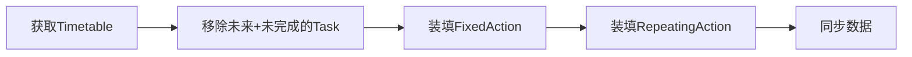

# 核心模块说明
## bean
+ Goal.java: 目标类，用于存储用户的目标信息
+ Action.java: 行为类，用于存储用户的行为信息
+ Task.java: 任务类，用于存储用户的任务信息
+ Milestone.java: 里程碑类，用于存储用户的里程碑信息
## restriction
+ Restriction.java: 限制类，用于存储用户的限制信息

### Restriction, 限制类
+ AmountRestriction.java:
  - 任务数量约束，包括总数，未完成数，已完成数 
  - 要求总数大于等于未完成数和已完成数之和
+ TimeRestriction.java:
  - 时间约束，包括开始时间，结束时间
  - 要求任务安排在开始时间到结束时间
+ IntervalRestriction.java:
  - 重复任务的间隔约束, 包括interval和repeat_times 
  - 要求在interval天内重复repeat_times次
+ FixedTimeRestriction.java:
  - 固定时间约束，包括开始时间和结束时间、类型和日期 
  - 要求任务按照重复类型和日期，在开始时间和结束时间之间进行
+ PriorityRestriction.java:
    - 优先级
+ ResourceRestriction.java:
    - 资源约束，包括资源名称、消耗量和数量


> 限制类用于存储用户的限制信息，限制信息包括固定时间限制、优先级限制、重复限制、资源限制、时间限制、地点限制等，限制类的属性包括限制类型、限制内容、限制描述等。
> 示例；
> 固定时间任务：在每年/月/周/日的某个时间点执行的任务，包含固定时间限制与时间限制（可选）。
> 重复任务：重复执行的任务，包含重复限制和时间限制。
 
## Dao
## Database
(略)

## model
+ `interface Valuer`: 评估一项行为的优先级 
+ `abstract Scheduler` : 根据传入的Valuer, 按照特定规则进行规划,产生一个对应时间的`TimeTable`

+ `SimpleValuer`: 一个简单的实现, 按目标重要性安排
+ `SimpleScheduler`: 

+ `DeadlineValuer`: 按结束时间来安排


  采用Pipeline模式，将Time Table作为加工对象。



- 如何装填?
  1. 获取带标记的Action
  2. 按标记规则装填, 并检验是否满足其他Restrictions
  3. 若满足, 装填并更新数据( 如Valuer/Restrictions ).
- 谁来检验?

  Restrictions

- Valuer有什么用?

  当有大量任务时, 优先做更重要的.

- 如何扩展?

  添加新的装填器/限制.

## util

+ `TimeTable`: 提供与TaskDB最直接的交互, 包括: 
  - 任务时间展示
  - 任务时间调整
  - 添加/删除任务
  - 任务完成度反馈
  - 数据同步
  - 如果可以, 反馈其他东西(优先级等限制的调整)
  
可以把他看成特定时间段的taskDB接口.
  
## Converter

用于存入数据库时类型的转换.
略.

# 如何使用？


## 数据存入
直接调用数据库存。
示例：
```kotlin
    val db = TestDB.getDatabase(appContext)
    val dao = db.testDao()
    val testData = TestData(para1,para2,para3)
    dao.insert(testData)
```

## 数据查询

示例:
```kotlin
import cn.edu.ustc.timeflow.model.DBHelper
    val db = TestDB.getDatabase(appContext)
    val dao = db.testDao()
    
    val testData = dao.getAll()
```
> 注: 用这种方式处理Goal/Action/Milestone的数据
> `Task` 不推荐手动操作

## 自动规划

```kotlin
import cn.edu.ustc.timeflow.model.Scheduler
import cn.edu.ustc.timeflow.util.TimeTable

val scheduler: Scheduler = new()//用具体某种Scheduler来初始化
var timeTable: TimeTable = scheduler.getTimeTable(start,end)//获得规划后的TimeTable
```


